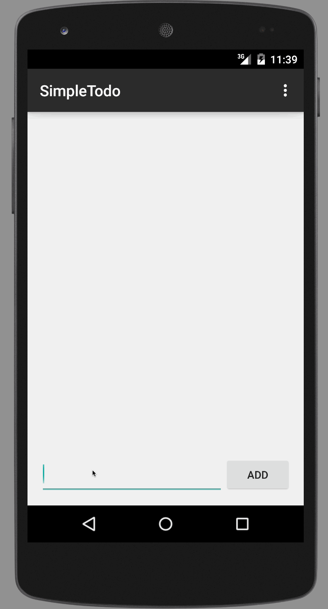

# simpletodo codepath prework

This is the prework for codepath's android class
Time spent:  about 5 hours

What it does:
 * [x] User can successfully add, remove, and edit items.
 * [x] Items persist in flat files
 * [x] Items maintain original order

